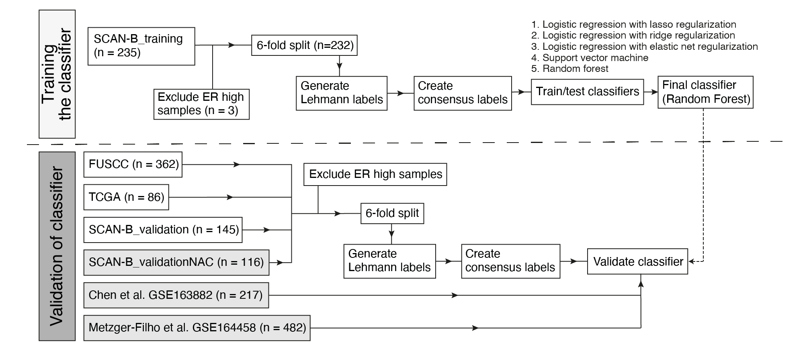

 # **Pred**ict **I**mmune I**mm**ediatly (PredImm)

## About

PredImm is an immune classifier developed for triple-negative breast cancer samples with FPKM gene expression values. 
It is derived from the [Lehmann et al. TNBCtype](https://www.jci.org/articles/view/45014) Immunomodulatory subtype labels and developed with a Random Forest architecture. 
For more information on PredImm, see the associated published article: [link here when available]



 ## Installation

To use PredImm you will first need to install conda, see https://docs.anaconda.com/miniconda/

To run the code in this repository, the easiest is to clone it and then install the requirements

```
git clone https://github.com/StaafLab/PredImm
cd PredImm
conda env create -f environment/predimm.yml
```

## Using the predictor

PredImm comes with TCGA TNBC samples as an exmaple data set. To run this example, activate the conda environment and run the notebook or the script.

**To run the notebook:**
```
conda activate predimm
jupyter notebook
```
and open im_pred.ipynb

or start your code interpretered and choose predimm as kernel. 

Then follow the steps in the notebook.

**To run the script:**

```
# activate the conda environment
conda activate predimm
# make the script executable if needed
chmod +x ./bin/im_pred.py
# run the script
./bin/im_pred.py -i data/TCGA_fpkm.csv
```
the -i flag is used to give the (relative) path to the input file.

## Specifying output files

If you run the notebook, you can specify your own output file within the notebook. 
If using the script, you can specify a different output file name using the -o flag. 

## Running with a Singularity container

PredImm has been developed on Rocky Linux 8.8 and has not been tested on other operating systems. If you run into problems with the code above, you can try running PredImm within a container. First, Singularity must be installed. Follow the information available on https://docs.sylabs.io/guides/3.8/admin-guide/installation.html or, alternatively, create (and activate) a conda environment that contains Singularity. After cloning this repo, go into the PredImm/ directory, build the container using the provided .def file (only needs to be performed once to create the .sif file), and run PredImm. You can follow the code below, just remember to update the path leading to the PredImm directory in your own computer.

```
# clone this repo
git clone https://github.com/StaafLab/PredImm
# move into the directory
cd PredImm
# build the container
singularity build --fakeroot predimm.sif singularity/predimm_singularity.def
# make the script executable if needed
chmod +x ./bin/im_pred.py
# run the analysis on the example dataset
singularity exec --bind /path/to/PredImm:/workspace predimm.sif bash -c "source /opt/miniconda3/etc/profile.d/conda.sh; conda activate predimm; ./bin/im_pred.py -i data/TCGA_fpkm.csv"
```

## License

Copyright (C) 2024 Suze Roostee

This program is free software: you can redistribute it and/or modify it under the terms of the GNU General Public License as published by the Free Software Foundation, either version 3 of the License, or (at your option) any later version.

This program is distributed in the hope that it will be useful, but WITHOUT ANY WARRANTY; without even the implied warranty of MERCHANTABILITY or FITNESS FOR A PARTICULAR PURPOSE. See the GNU General Public License for more details.

You should have received a copy of the GNU General Public License along with this program. If not, see https://www.gnu.org/licenses/.

