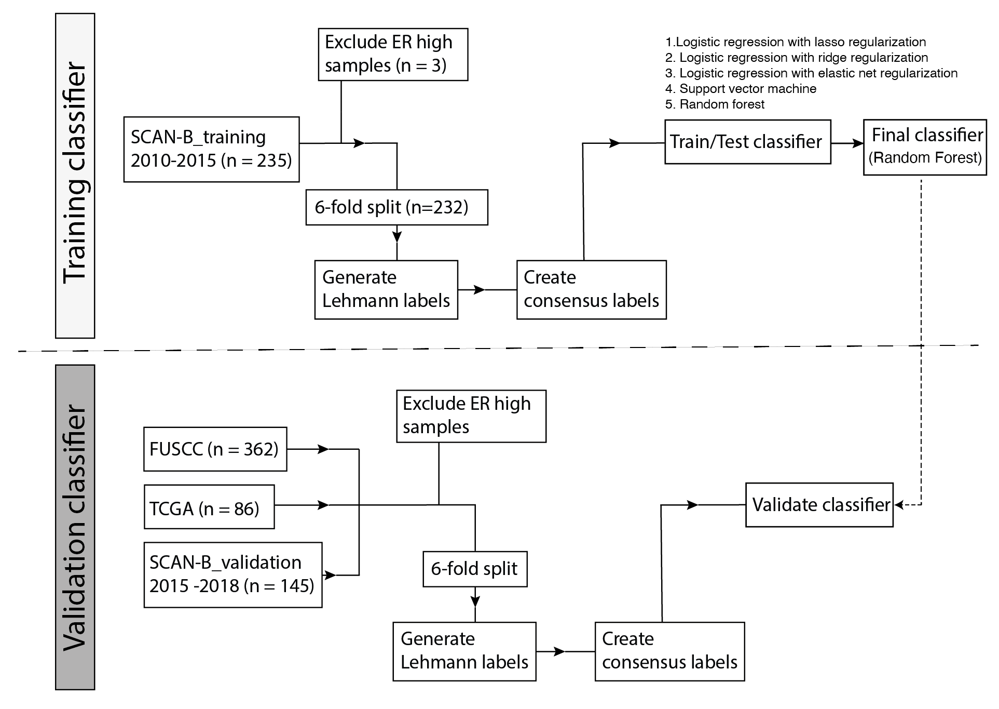

 # **Pred**ict **I**mmune I**mm**ediatly (PredImm)

## About

PredImm is an immmune classifier developed for triple-negative breast cancer gene expression samples with fpkm values. 
It is derived from the Lehmann immunomodulatory labels and developed with a Random Forest architecture. 
For more information on PredImm, see the associated manuscript/article: [link here]



 ## Installation

To use PredImm you will first need to install conda, see https://docs.anaconda.com/miniconda/

To run the code in this repository, the easiest is to clone it and then install the requirements

```
git clone https://github.com/StaafLab/PredImm
cd PredImm
conda env create -f environment/predimm.yml
```

## Using the predictor

PredImm comes with TCGA TNBC samples as an exmaple data set. To run this example, activate the conda environment and run the notebook or the script.

**To run the notebook**
```
conda activate predimm
jupyter notebook
```
and open im_pred.ipynb

or start your code interpretered and choose predimm as kernel. 

Then follow the steps in the notebook.

**To run the script**

```
conda activate predimm
./im_pred.py -i data/tcga_fpkm.csv
```
the -i flag is used to give the (relative) path to the input file.

## Specifying output files

If you run the notebook, you can specify your own output file within the notebook. 
If using the script, you can specify a different output file name using the -o flag. 


Note: PredImm has been developed on Rocky Linux 8.8 and is not tested on other operating systems.

## License

Copyright (C) 2024 Suze Roostee

This program is free software: you can redistribute it and/or modify it under the terms of the GNU General Public License as published by the Free Software Foundation, either version 3 of the License, or (at your option) any later version.

This program is distributed in the hope that it will be useful, but WITHOUT ANY WARRANTY; without even the implied warranty of MERCHANTABILITY or FITNESS FOR A PARTICULAR PURPOSE. See the GNU General Public License for more details.

You should have received a copy of the GNU General Public License along with this program. If not, see https://www.gnu.org/licenses/.

